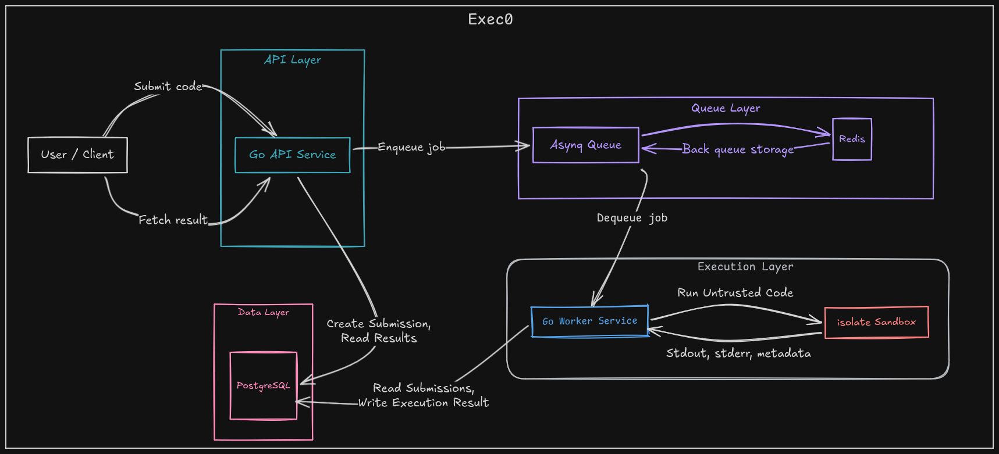

# Exec0

A code execution service API built in Go. Submit code, run it in a sandbox with configurable resource limits, and retrieve results asynchronously.


## Features

- **Sandboxed execution** via isolate with cgroups — CPU, memory, wall time, processes, file size, network, and stack limits
- **Async processing** — submissions are queued via Redis (asynq) and processed by a separate worker
- **Multi-language** — ships with C++ (GCC), Java (OpenJDK), and Python; extensible via the `languages` table
- **Retry support** — infrastructure failures retry up to 3 times; user code errors (TLE, RE, CE) do not
- **Concurrent execution** — worker runs multiple submissions in parallel with collision-free sandbox allocation

## Requirements

- Go 1.26+
- PostgreSQL 18.3+
- Redis
- [isolate](https://github.com/ioi/isolate) (with cgroup support enabled)

## Quick Start (Docker)

The fastest way to get everything running — API, worker, database, queue, and full observability stack:

```bash
# 1. Copy and configure environment
cp .env.sample .env

# 2. Start everything
docker compose up -d

# 3. Verify
curl http://localhost:8080/health
```

This starts 10 services:

| Service | Port | Purpose |
|---------|------|---------|
| exec0-api | 8080 | API server |
| exec0-worker | 9091 | Execution worker (isolate sandbox) |
| postgres | 5432 | Database (auto-migrated + seeded) |
| redis | 6379 | asynq message queue |
| otel-collector | 4317 | OpenTelemetry Collector |
| tempo | 3200 | Distributed tracing backend |
| loki | 3100 | Log aggregation |
| promtail | — | Ships container logs to Loki |
| prometheus | 9090 | Metrics scraping |
| grafana | 3000 | Dashboards (admin/admin) |


## API

### Languages

| Method | Endpoint            | Description         |
|--------|---------------------|---------------------|
| GET    | `/languages`        | List all languages  |
| GET    | `/languages/{id}`   | Get language by ID  |

### Submissions

| Method | Endpoint              | Description              |
|--------|-----------------------|--------------------------|
| POST   | `/submissions`        | Create a new submission  |
| GET    | `/submissions`        | List submissions (paginated) |
| GET    | `/submissions/{id}`   | Get submission by ID     |

### Health

| Method | Endpoint  | Description  |
|--------|-----------|--------------|
| GET    | `/health` | Health check |

### Create Submission

```json
POST /submissions
{
  "language_id": 1,
  "source_code": "#include<iostream>\nint main(){std::cout<<\"hello\";return 0;}",
  "stdin": "optional input",
  "cpu_time_limit": 5.0,
  "wall_time_limit": 10.0,
  "memory_limit": 256000
}
```

All resource limit fields are optional — server defaults apply when omitted.

### Submission Lifecycle

`pending` → `compiling` → `running` → `accepted` | `compilation_error` | `runtime_error` | `time_limit_exceeded` | `internal_error`


## Supported Languages

| Language | Version     | Compile Command | Run Command |
|----------|-------------|-----------------|-------------|
| C++      | GCC 14.2.0  | `g++ -B/usr/bin -o main main.cpp` | `./main` |
| Java     | OpenJDK 23  | `javac Main.java` | `java Main` |
| Python   | 3.13        | — | `python3 script.py` |

Add more by inserting into the `languages` table.

## Observability

- **Metrics** — Prometheus scrapes `/metrics` on both API (8080) and worker (9091). 14 custom `exec0_*` metrics covering HTTP requests, job processing, sandbox failures, DB operations.
- **Tracing** — OpenTelemetry distributed traces flow from API through Redis queue to worker. Spans cover HTTP requests, DB calls, and sandbox phases (init, compile, run). Traces export via OTLP gRPC to the collector, then to Tempo.
- **Logging** — Structured JSON logs (zerolog) with `trace_id` and `request_id` fields. Promtail ships container logs to Loki with `trace_id` as an indexed label, enabling log-to-trace correlation in Grafana.

## Configuration

All configuration is via environment variables (`.env` file). See `.env.sample` for the full list.

| Variable | Description | Docker default |
|----------|-------------|----------------|
| `PRIMARY_ENV` | `production` (JSON logs) or `local` (console) | `production` |
| `SERVER_PORT` | API server port | `8080` |
| `DATABASE_HOST` | PostgreSQL host | `postgres` |
| `REDIS_ADDRESS` | Redis address | `redis:6379` |
| `WORKER_CONCURRENCY` | Worker parallelism (0 = auto) | `4` |
| `OTEL_ENDPOINT` | OTel Collector gRPC endpoint | `otel-collector:4317` |

See `internal/config/` for the full list of execution defaults (CPU time, memory, processes, etc.).
